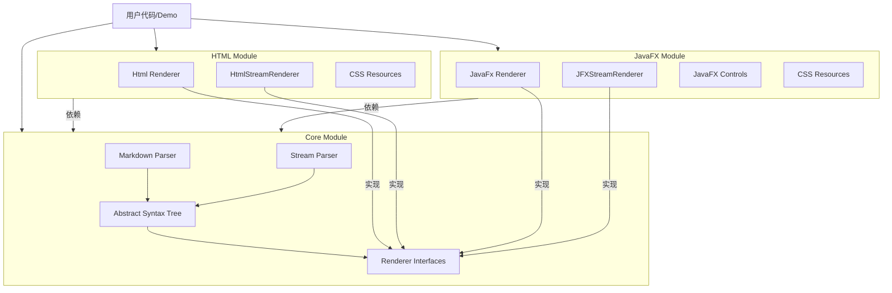

# 项目架构文档

## 1. 总体架构

`markdown-stream-render` 采用分层架构设计，核心层负责解析与 AST 构建，表现层负责具体平台的渲染实现。

## 2. 模块详解

### 2.1 Core 模块 (`markdown-stream-render-core`)

核心模块，不包含任何 UI 依赖，仅依赖 JDK 标准库。

* **AST (抽象语法树)**: 定义了 Markdown 文档的结构，如 `Document`, `Paragraph`, `Heading`, `List` 等。所有节点继承自
  `Node` 类。
* **Parser (解析器)**:
    * `MarkdownParser`: 全量解析器，将 Markdown 字符串转换为 AST。
    * `StreamMarkdownParser`: 流式解析器，支持增量输入，边解析边触发渲染事件。
    * `BlockParser` / `InlineParser`: 负责具体的块级和行内元素解析，支持插件扩展。
* **Extensions (扩展)**: 内置了常用的扩展语法支持，如 `Admonition` (警告块) 和 `Math` (数学公式) 的 AST 节点定义及解析逻辑。
* **Renderer Interfaces**: 定义了 `MarkdownRenderer` 与 `StreamMarkdownRenderer`（以及打字机预览用的 `StreamMarkdownTypingRenderer`）等接口，供上层模块实现。

### 2.2 HTML 模块 (`markdown-stream-render-html`)

负责将 Markdown 渲染为 HTML 字符串，适用于 Web 环境或生成静态报告。

* **Renderers**:
    * `HtmlRenderer`: 遍历 AST 生成完整的 HTML 片段。
    * `HtmlStreamRenderer`: 配合流式解析器，实时输出 HTML 片段。
* **CSS Support**: 内置了 `markdown.css` 及扩展样式，通过 `HtmlCssProvider` 提供。
* **Extensions**: 实现了 `Admonition` 和 `Math` 节点的 HTML 渲染逻辑（生成带 class 的 div/span）。

### 2.3 JavaFX 模块 (`markdown-stream-render-javafx`)

负责将 Markdown 渲染为 JavaFX 节点树（Scene Graph），适用于桌面应用。

* **Renderers**:
    * `JavaFxRenderer`: 将 AST 转换为 `VBox` 等 JavaFX 容器。
* **Styling**: 使用 JavaFX CSS 机制，提供 Light/Dark 主题。
* **Extensions**: 实现了 `Admonition`（VBox/Label）和 `Math`（Label）等扩展节点的渲染逻辑。

## 3. 关键设计模式

* **Visitor 模式**: 渲染器通过实现 `Visitor` 接口（或在内部使用 Visitor）来遍历 AST 节点并执行渲染逻辑。
* **Factory 模式**: 解析器和渲染器通过 Factory 接口（`BlockParserFactory`, `NodeRendererFactory`）来创建实例，支持插件化扩展。
* **Builder 模式**: `MarkdownParser` 和 `HtmlRenderer` 使用 Builder 模式进行复杂的配置构建。
